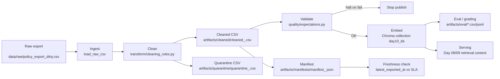

# Kiến trúc pipeline — Lab Day 10

**MSV:** 2A202600736

**Tên:** Mai Ngọc Duy

**Cập nhật:** 2026-06-10

---

## 1. Sơ đồ luồng (bắt buộc có 1 diagram: Mermaid / ASCII)

`run_id` được tạo trong `etl_pipeline.py run` hoặc truyền bằng `--run-id`, rồi ghi vào log, manifest và metadata Chroma. Freshness đo trên manifest sau publish; quarantine được ghi trước validate để có bằng chứng điều tra khi pipeline halt.

---

## 2. Ranh giới trách nhiệm

| Thành phần | Input | Output | Owner nhóm |
|------------|-------|--------|--------------|
| Ingest | `data/raw/policy_export_dirty.csv` | List row thô, `raw_records` trong log | Ingestion / Raw Owner |
| Transform | Row thô | Cleaned rows + quarantine rows | Cleaning & Quality Owner |
| Quality | Cleaned rows | Expectation result `OK/FAIL`, quyết định halt | Cleaning & Quality Owner |
| Embed | Cleaned CSV đã validate | Chroma collection `day10_kb`, metadata `doc_id/run_id` | Embed & Idempotency Owner |
| Monitor | Manifest + eval artifacts | `freshness_check`, before/after evidence | Monitoring / Docs Owner |

---

## 3. Idempotency & rerun

Embed dùng `col.upsert(ids=ids, documents=documents, metadatas=metadatas)` với `chunk_id` stable sinh từ `doc_id|chunk_text|seq`. Trước khi upsert, pipeline lấy toàn bộ id hiện có trong collection và xóa các id không còn trong cleaned snapshot hiện tại. Vì vậy rerun cùng dữ liệu không tạo duplicate vector, và khi rule cleaning thay đổi nội dung chunk thì id cũ bị prune khỏi collection.

Evidence Sprint 3: cả `sprint3-bad` và `sprint3-good` đều log `embed_upsert count=36 collection=day10_kb`; khi đổi snapshot, log có `embed_prune_removed=1`.

---

## 4. Liên hệ Day 09

Pipeline Day 10 là tầng dữ liệu trước khi agent Day 09/RAG đọc knowledge base. Thay vì embed trực tiếp tài liệu text gốc, Day 10 mô phỏng export từ nhiều hệ thống nguồn, clean dữ liệu, validate expectation, rồi publish vào Chroma collection `day10_kb`. Day 09 có thể trỏ retrieval sang collection này hoặc dùng cùng corpus đã được publish để tránh trả lời từ version stale như refund `14 ngày` hoặc HR 2025 `10 ngày phép năm`.

---

## 5. Rủi ro đã biết

- `freshness_check=FAIL` trên dữ liệu mẫu vì `latest_exported_at=2026-04-11T00:00:00`, cũ hơn SLA 24 giờ.
- Semantic retrieval vẫn có thể ưu tiên chunk gần nghĩa nhưng sai level, ví dụ P2 escalation; đã giảm rủi ro bằng enrich context P1 canonical trong cleaning.
- Expectation hiện là custom Python, chưa dùng Great Expectations/pydantic schema thật.
- Nếu thêm nguồn mới, cần cập nhật đồng bộ `ALLOWED_DOC_IDS`, `REQUIRED_GRADING_DOC_IDS`, data contract và eval questions.
